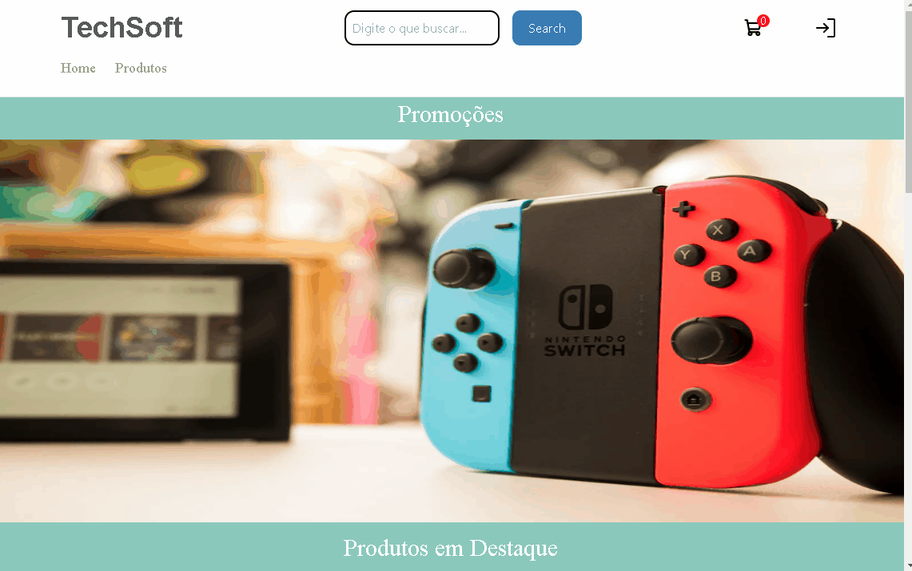

<h1 align="center">
    
     
    TechSoft
</h1>

Projeto de uma loja feito na matéria de AP2 refatorada com ReactJS, <a href="https://www.typescriptlang.org/">Typescript</a> e <a href="https://tailwindcss.com/docs/installation">Tailwind CSS</a>

## 💡 Tecnologias Usasdas
<ul>
<li><a href="https://www.typescriptlang.org/">TypeScript</a>

<li><a href="https://tailwindcss.com/">Tailwind CSS</a>

<li><a href="https://postcss.org/">PostCSS</a>

<li><a href="https://axios-http.com/docs/intro">Axios</a>

<li><a href="https://mui.com/core/">MUI Core</a>

<li><a href="https://phosphoricons.com/">Phospor Icon</a>

<li><a href="https://react-hook-form.com/">React Hook Form</a>

<li><a href="https://reactrouter.com/en/main">React Route</a>

<li><a href="https://react-query-v3.tanstack.com/">React Query</a>
</ul>
 
<h3>Instalações</h3>
´´´

    Instalação TailwindCSS
        npm install -D tailwindcss
        npx tailwindcss init

    Instalação Post CSS
        npm install -D tailwindcss postcss autoprefixer
        npx tailwindcss init -p

    Instalação MUI Core
        npm install @mui/material @emotion/react @emotion/styled

    Instalação Phospor Icon
        npm install --save phosphor-react

    Instalação React Hook Form
        npm install react-hook-form

    Instalação React Route
        npm i react-router-dom

    Instalação React Query
        npm i react-query

´´´

 

    <h2>🚧 Em Construção</h2>
    
    
    

Alerrando © 2022 Obrigado por acessar
